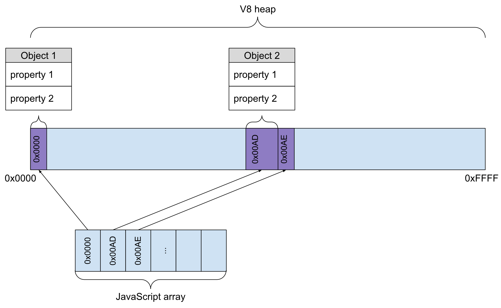
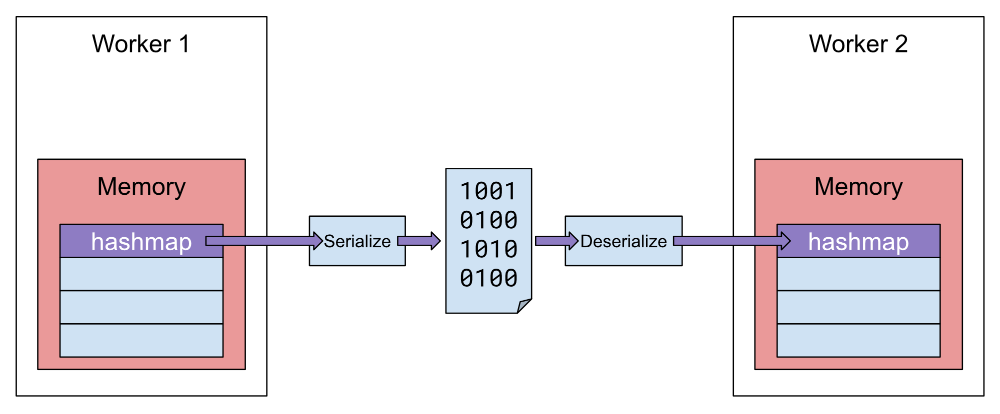
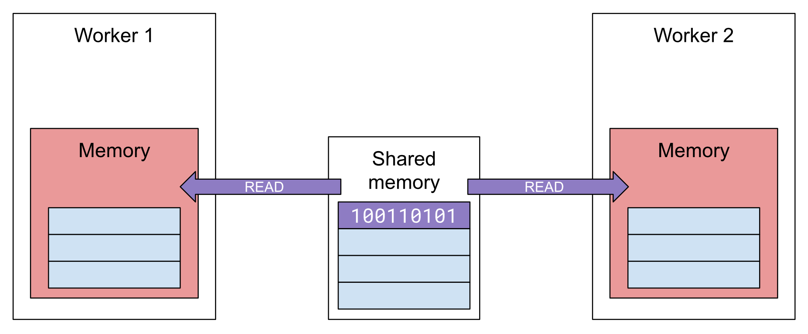

# SharedMemoryDatastructures
## Introduction
This package is intended to speed up the communication time between different JavaScript threads by exposing data structures that internally use a `SharedArrayBuffer` to store all required information. `SharedArrayBuffers` can be transfered and shared by multiple threads without an extra cost, but can only contain binary data.

I developed this package to partially overcome this issue by providing users with rich datastructures that implement the default JavaScript API and that can be (more or less) transparently used.

One downside to these datastructures is that they don't internally store references to objects that are being stored, but rather serialize an object and store it completely. This limitation cannot be overcome since objects themselves cannot be shared amongst threads by design (they can only be copied).

## Installation
This package is available on npm and can be installed using

```
npm install shared-memory-datastructures
```

## Datastructures
### ShareableMap
Partially implements the JavaScript Map interface and tries to adhere to the map principles as good as possible. This map is currently aimed at setting each key, value pair once and reading the afterwards as `delete()` is not supported (and changing a key's value is also not supported).

**Not supported**
* `delete(key: K)`
* `set(key: K, value: V)` when `key` is already present in the map.

The reason for these functions that are not supported is straightforward. By deleting / changing a key's value, it's size changes which could leave empty gaps of space in the data storage array. We should fully support some form of defragmentation in order for memory requirements not to blow up in order to support the deletion and alteration of values.

## Implementation
### Introduction
This hashmap has been implemented to circumvent the cost of copying a data structure between different workers in JavaScript. The default JavaScript implementation of a hashmap needs to be serialized on the side of the sending thread and then deserialized on the receiving side. This process takes up quite a lot of computing resources and can take a significant amount of time for large data structures. To this date, there's only one type of data structure that can be shared by multiple threads and does not need to be copied, which is the `SharedArrayBuffer`.

A `SharedArrayBuffer`, however, can only be used to store binary data which makes it very hard to incorporate it in most applications. In order to simplify matters, and to provide users that require shared memory access across workers with something they're familiar with, I developed a hashmap that internally uses a `SharedArrayBuffer`. This hasmap can thus be transferred between workers with a near zero-cost and can lead to a significant speedup for complex applications.

### Object storage model
Before we continue, it's important to note how objects and items are represented by JavaScript. The explanation provided here is completely based upon the V8 engine (which drives Chrome, NodeJS, Electron and a lot of other software products), but will be similar for other JavaScript engines.

Every new object that's created by a JavaScript-program lives on the heap. The heap is a contiguous part of memory in which objects are dynamically allocated. Internally, pointers to these objects on the heap are used to keep track of which object lives where. These pointers to objects reduce the required amount of memory for all kinds of different data structures in your JS-application. If an application, for example, constructs an array containing 10 objects, than the array itself only requires the memory to store 10 pointers (since the objects themselves are already part of the V8 heap).


__Figure 1:__ *Only references to JavaScript objects are stored in an array, not the data that makes up the objects themselves. This means that if 2 arrays point to the same objects, the objects themselves are only kept once in memory!*

### Shared memory in JavaScript
The easiest way to build a multithreaded application in JavaScript, is by using workers. Every worker can work in isolation from all other workers, and multiple workers can perform tasks in parallel on multi-core machines. In contrast to the "thread" concept that is used by other programming languages, workers in JavaScript don't share memory by default. Some applications or tasks require large sets of data during their operation. Most of the time, such a big dataset is constructed only once, and read by multiple workers in parallel that each perform a specific task. If this dataset consists of structured data, organised as (key, value)-pairs, you will most likely use a hashmap sooner or later.

The default JavaScript hashmap is not transferable between workers. This means that the complete map (including all of the objects it refers to) need to be copied from the memory of one worker to the memory of another worker. Copying small amounts of data is not an issue and will most likely occur without notice. Larger amounts of data, however, can easily take multiple seconds _and_ will block the main thread from doing anything interesting. The application will not be responsive during the transfer process which will lead to a bad user experience. To make matters even worse, all objects that are send between different workers need to be serialized and deserialized on the sending and receiving worker side respectively.


__Figure 2:__ *If any JavaScript object is send (through `postMessage`) from one worker to another, it will first get serialized into a binary representation, then the binary representation will be copied into the memory of the second worker and will finaly get deserialized into the original hashmap. It is obvious that these serialize and deserialize operations can take quite some time for large data structures.*

Now, this is where JavaScript's [ArrayBuffer](https://developer.mozilla.org/en-US/docs/Web/JavaScript/Reference/Global_Objects/ArrayBuffer) and [SharedArrayBuffer](https://developer.mozilla.org/en-US/docs/Web/JavaScript/Reference/Global_Objects/SharedArrayBuffer) come in play. An `ArrayBuffer` can be seen as a raw portion of memory (of a fixed size) in which arbitrary binary data can be stored. `ArrayBuffer`'s can be [transferred](https://developer.mozilla.org/en-US/docs/Web/API/Transferable) between different workers, which dramatically speeds up the communication between workers. Whenever the ownership of an `ArrayBuffer` is transferred from worker A to worker B, worker A no longer has access to the buffer. An `ArrayBuffer` can only be used by one worker at a time!


__Figure 3:__ *ArrayBuffers can easily be transferred between multiple workers. This means that no serialization or deserialization operation needs to be performed and that communication speed is drastically improved.*

A `SharedArrayBuffer` is very similar to an `ArrayBuffer`, but can optionally be shared by multiple workers at the same time (if all workers only perform read operations on the buffer). This particular buffer's name originates from the fact that it resides in a special portion of memory that can be shared by multiple workers (which is conveniently called "shared memory"). The hashmap that's implemented in this package internally works with a `SharedArrayBuffer` and can thus be shared between multiple workers at an almost zero-cost. How exactly the hashmap is encoded as a raw binary buffer can be read in the [encoding of the hashmap]() chapter of this document.


__Figure 4:__ *SharedArrayBuffers are kept in a special part of memory, called the shared memory. This memory can be read by multiple workers in parallel, which further improves performance for multithreaded applications.*

Note that no serialization or deserialization operations are performed when sending `ArrayBuffer`'s or `SharedArrayBuffer`'s between workers, which leads to an additional performance increase. A downside of these buffer primitives is that you can only read and write integers to and from them. This requires us to implement the encoding of a hashmap into bytes ourselves, which is exactly what this package does for you.

### Encoding of the hashmap


### Performance metrics

### Compatibility with JS hashmap interface
